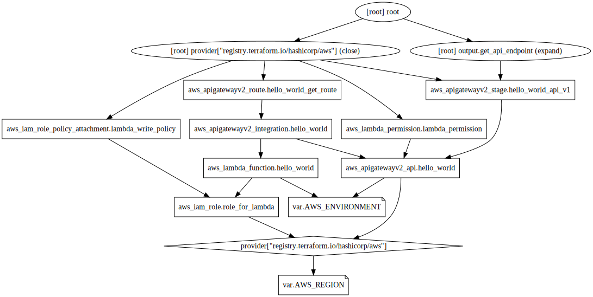

# Hello World Api

This is a standard "Hello World" API hosted on AWS. As of now it only supports GET operations but that can easily be expanded to handle POST, PUT, etc.

### AWS Architecture

The API is handled via AWS API Gateway.

The function logic for the response is integrated via AWS Lambda Node.js.

### CI/CD

The CI/CD is handled via CircleCI and as of now only has one environment and one build/deployment stage with multiple jobs within the pipeline. It also contains one simple test written in bash to ensure the api is responding correctly via curl.

The following environment variables will need to be added for deployment:

AWS_ACCESS_KEY_ID=""
AWS_SECRET_ACCESS_KEY=""

### Terraform

The current Terraform backend is setup for AWS S3 state file management. You can find more information [here](https://www.terraform.io/language/settings/backends/s3)

The current build is based on the graph below:
  

